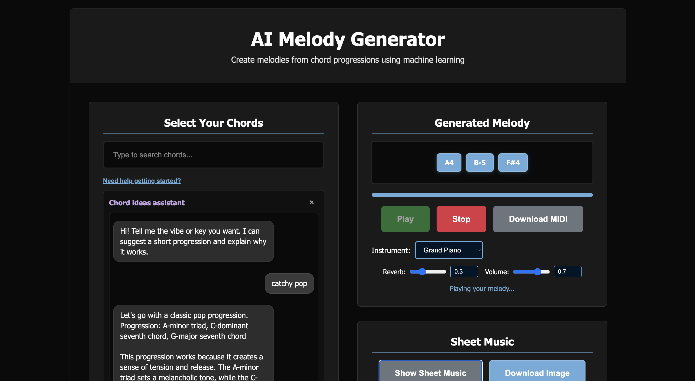

# AI Melody Generator
A Flask web app that generates melodies from chord progressions using an LSTM model, with an integrated chat assistant for chord brainstorming, sheet music rendering, and MIDI export.


## Install Dependencies
```bash
pip install -r requirements.txt
```

This includes `music21` for MusicXML conversion and `pretty_midi` for MIDI writes.

## Optional: LLM Integration
Set an API key to enable advanced analysis and more helpful chat replies. The app supports using an NVIDIA NIM endpoint via the `OPENAI_API_KEY` bearer token.

```bash
export OPENAI_API_KEY="your_api_key_here"
# Or add to a .env file in the project root
```

Without a key, the app provides a lightweight fallback for the chat and analysis.

## How to Run

```bash
python run_app.py
```

## Using the Web UI

1. **Select Chords**: Type to filter and click a chord to add it. Selected chords appear as tags.
2. **Chat Help (Need help getting started?)**: Opens the assistant. Ask for ideas (e.g., “Suggest a catchy progression in C major”).
   - Suggestions include clickable chips and an “Add progression” button.
3. **Set Duration**: Choose how long each chord lasts.
4. **Generate Melody**: Creates a melody and shows notes.
5. **Play / Stop / Download MIDI**: Control playback and export MIDI.
6. **Sheet Music**: Use “Show Sheet Music” to render notation. Use “Download Image” to save the page as PNG.
7. **Analyze Melody**: Get concise AI tips on harmony, contour, and improvements.




